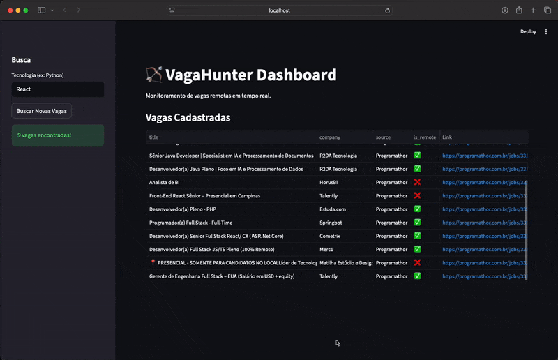

# VagaHunter API 🏹

API REST para monitoramento e agregação de vagas de emprego remotas.



## 🚀 Features
- **Busca de Vagas:** Agrega vagas de múltiplas fontes (Programathor, Remotar, etc).
- **Banco de Dados:** Armazena histórico de vagas em SQLite.
- **API REST:** Endpoints documentados (Swagger UI).
- **Architecture:** FastAPI + SQLAlchemy (Clean Architecture).

## 🛠️ Como rodar (Sem Docker)

1. **Instalar dependências:**
   ```bash
   python3 -m venv .venv
   source .venv/bin/activate
   pip install -r requirements.txt
   ```

2. **Rodar o servidor:**
   ```bash
   uvicorn app.main:app --reload
   ```

3. **Acessar Docs:**
   Abra http://localhost:8000/docs

## 🏗️ Estrutura
- `app/models`: Modelos do Banco de Dados.
- `app/routers`: Endpoints da API.
- `app/services`: Lógica de Scraping e Busca.
